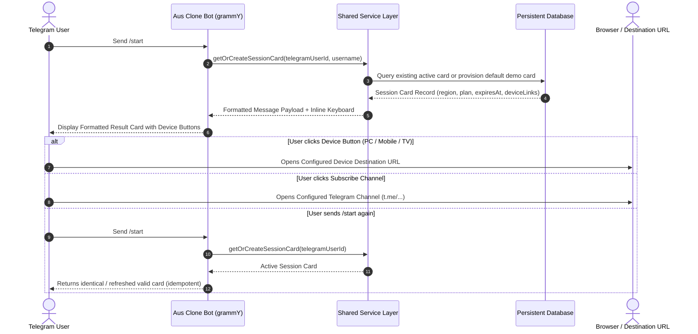
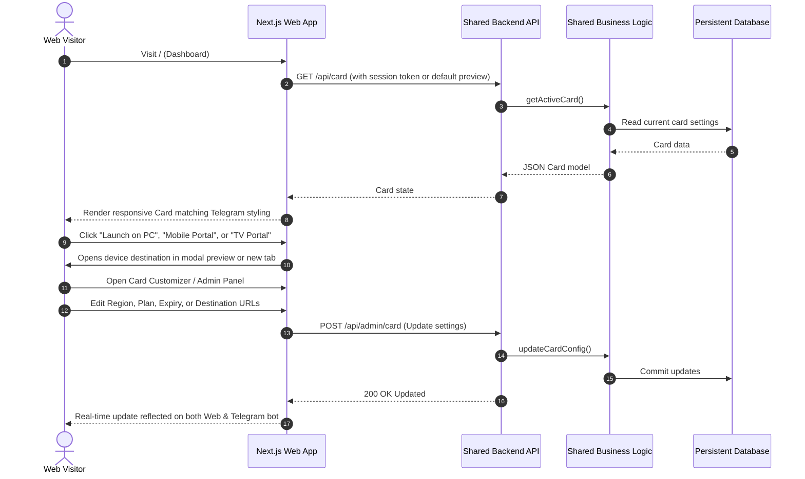

# Interaction Flows & UX Architecture — Aus Clone Bot

## 1. Telegram Bot User Journey

```mermaid
sequenceDiagram
    autonumber
    actor User as Telegram User
    participant Bot as Aus Clone Bot (grammY)
    participant Core as Shared Service Layer
    participant DB as Persistent Database
    actor External as Browser / Destination URL

    User->>Bot: Send /start
    Bot->>Core: getOrCreateSessionCard(telegramUserId, username)
    Core->>DB: Query existing active card or provision default demo card
    DB-->>Core: Session Card Record (region, plan, expiresAt, deviceLinks)
    Core-->>Bot: Formatted Message Payload + Inline Keyboard
    Bot-->>User: Display Formatted Result Card with Device Buttons
    
    alt User clicks Device Button (PC / Mobile / TV)
        User->>External: Opens Configured Device Destination URL
    else User clicks Subscribe Channel
        User->>External: Opens Configured Telegram Channel (t.me/...)
    else User sends /start again
        User->>Bot: Send /start
        Bot->>Core: getOrCreateSessionCard(telegramUserId)
        Core-->>Bot: Active Session Card
        Bot-->>User: Returns identical / refreshed valid card (idempotent)
    end
```

## 2. Companion Website User Journey

```mermaid
sequenceDiagram
    autonumber
    actor WebUser as Web Visitor
    participant Web as Next.js Web App
    participant API as Shared Backend API
    participant Core as Shared Business Logic
    participant DB as Persistent Database

    WebUser->>Web: Visit / (Dashboard)
    Web->>API: GET /api/card (with session token or default preview)
    API->>Core: getActiveCard()
    Core->>DB: Read current card settings
    DB-->>Core: Card data
    Core-->>API: JSON Card model
    API-->>Web: Card state
    Web-->>WebUser: Render responsive Card matching Telegram styling
    
    WebUser->>Web: Click "Launch on PC", "Mobile Portal", or "TV Portal"
    Web->>WebUser: Opens device destination in modal preview or new tab
    
    WebUser->>Web: Open Card Customizer / Admin Panel
    WebUser->>Web: Edit Region, Plan, Expiry, or Destination URLs
    Web->>API: POST /api/admin/card (Update settings)
    API->>Core: updateCardConfig()
    Core->>DB: Commit updates
    API-->>Web: 200 OK Updated
    Web-->>WebUser: Real-time update reflected on both Web & Telegram bot
```
